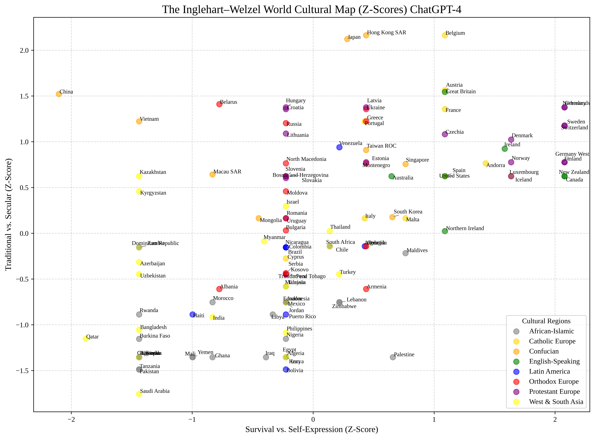
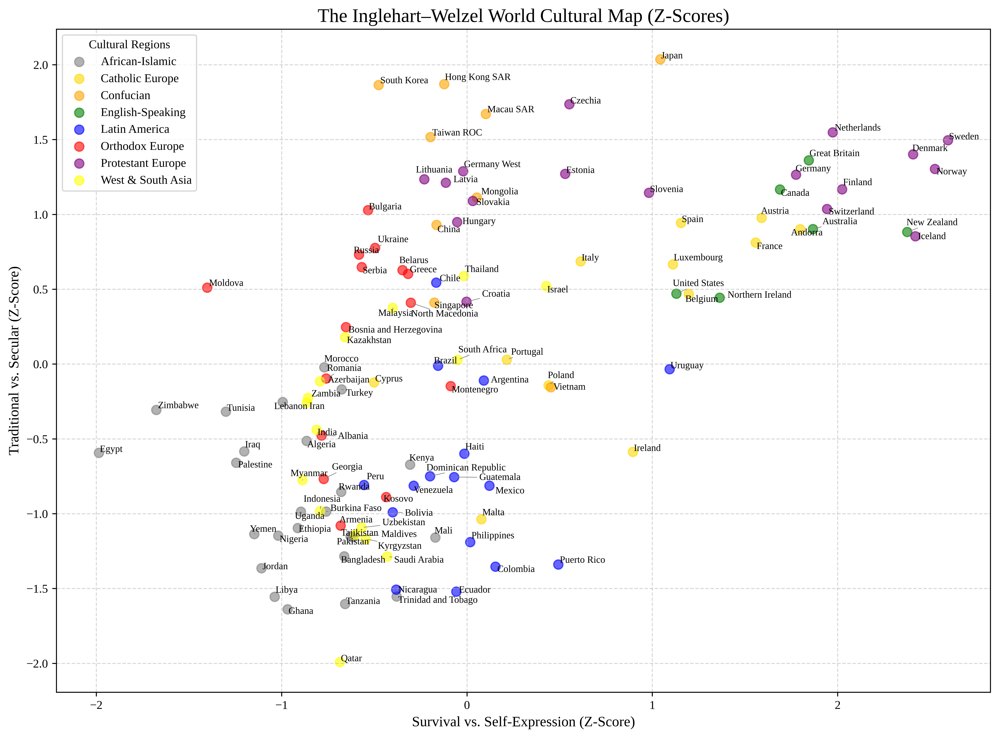
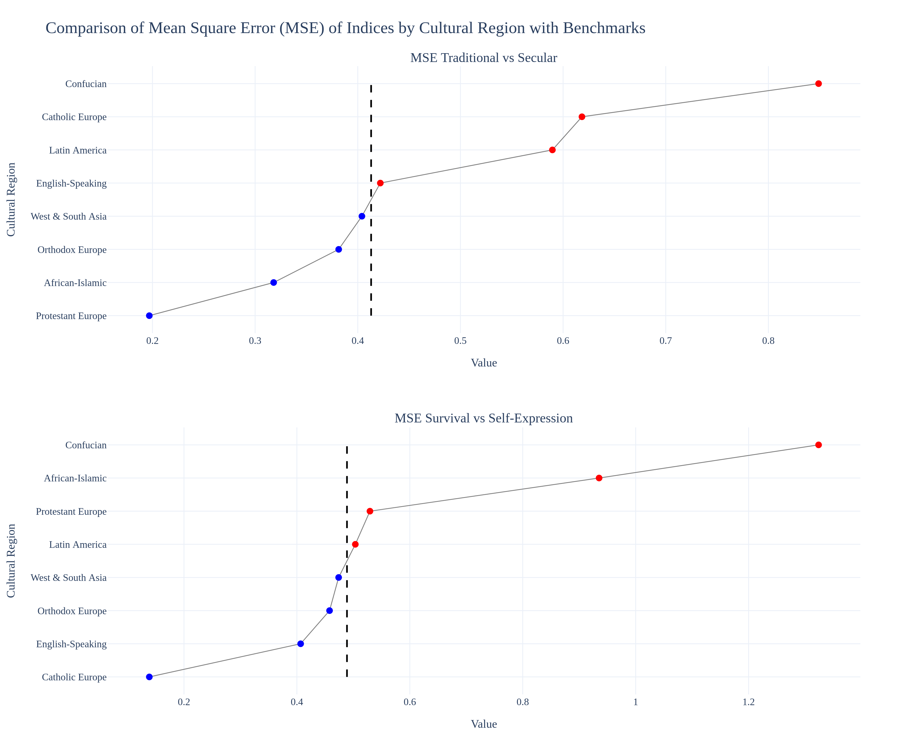
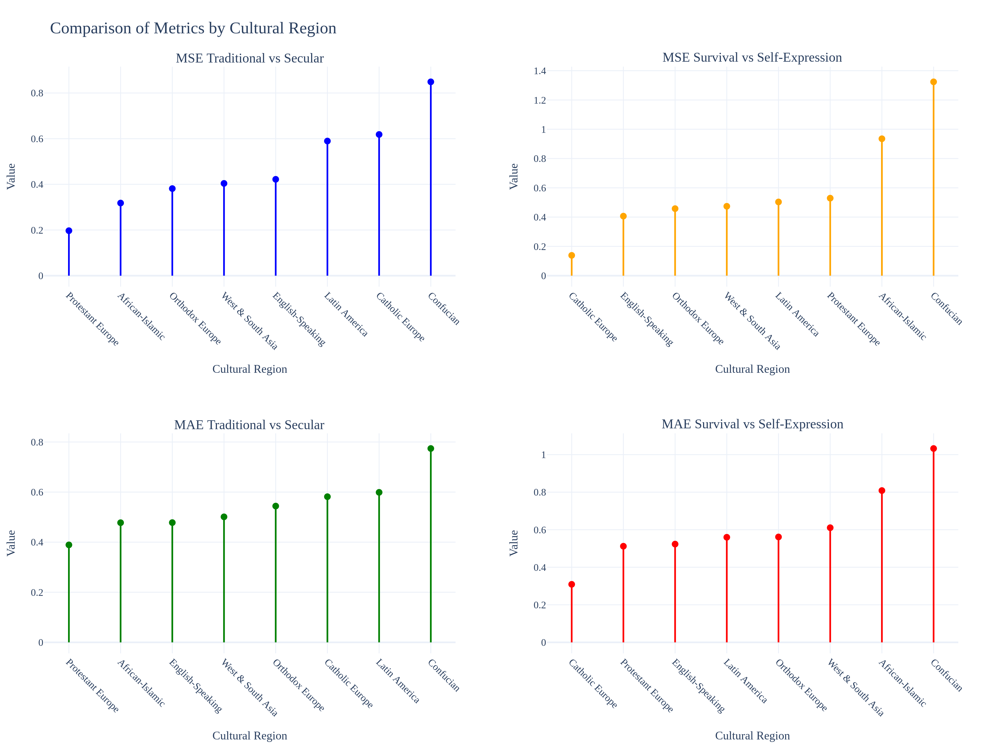
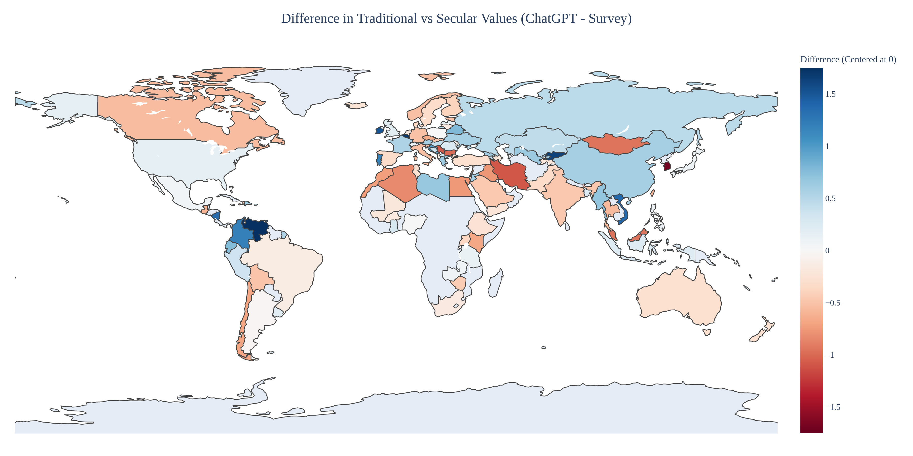
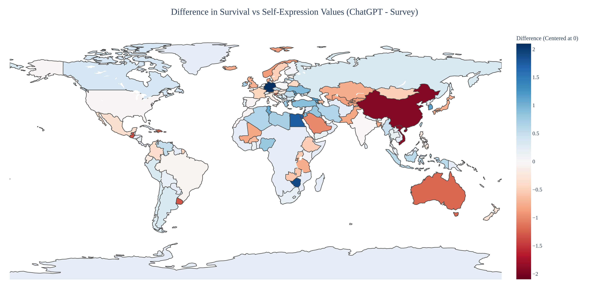
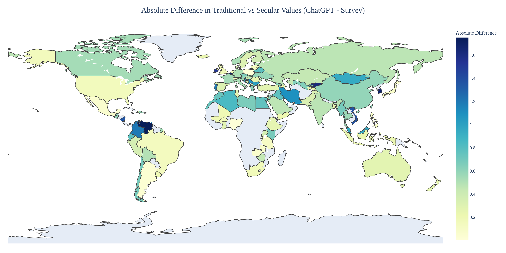
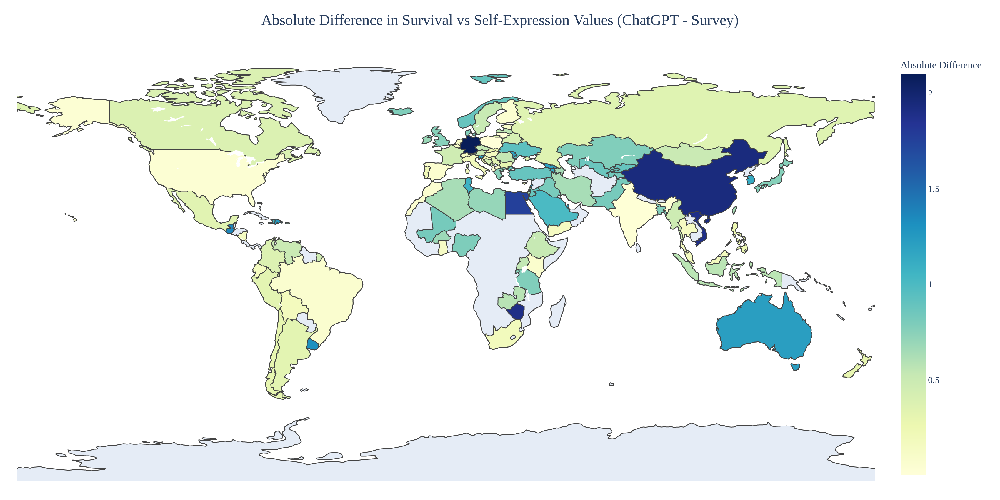

# 📊 EthosGPT Figure Gallery

This directory contains all the core figures generated by the EthosGPT framework. These visualizations support the paper *“EthosGPT: Mapping Human Value Diversity to Advance Sustainable Development Goals (SDGs)”* by Luyao Zhang.

Figures are grouped into three sessions corresponding to major analysis steps, plus an appendix section.

---

## 🧭 Session I: World Cultural Maps

### 🌍 ChatGPT-based World Cultural Map

### 🌍 Survey-based World Cultural Map

---

## 📉 Session II: Discrepancy and Error Analysis

### 🔎 Regional MSE Comparison (Lollipop Chart)

### 📊 Appendix: MSE and MAE by Region (Bar Chart)

---

## 🌐 Session III: Global Difference Maps

### 🔵 Difference: Traditional vs Secular (Raw)

### 🔵 Difference: Survival vs Self-Expression (Raw)

### 🟡 Absolute Difference: Traditional vs Secular

### 🟡 Absolute Difference: Survival vs Self-Expression

---

